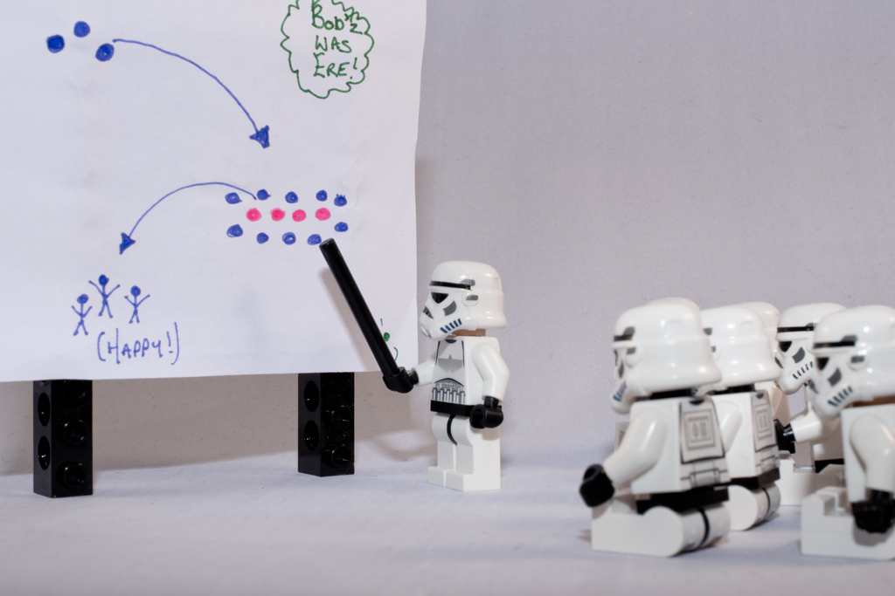

footer: \#ImprovYourBlog | \#WCSATX16 | @alanbush
slidenumbers: true

^ Hey everyone, we're here to talk about how you can improve your blog with improv rules.

---

# Alan Bush

* Nerd
* Dad and Husband
* Long-Time Improvisor
* Content Creator

^ But enough about improv, let's talk about me. I'm Alan. I'm a nerd. That's probably my defining characteristic. It defines most of the the things I do. I'm a husband and father - I get to tell dad jokes to my boys. Nerd. I've been an improvisor for more than half of my life now. Do the math, I started in High School. Nerd. And I'm also a content creator. I'm a Community Manager at Rackspace - Again, nerd.

---

# [fit] Technical Q&A
# [fit] Documentation
# [fit] Rackspace Blog

^ A while back I started to track all of the places I was creating content. I write a lot at work. Mostly technical help Q&A stuff. I also write proactive help documentation and tutorials. I write for the Rackspace Blog.

<!-- Can I find an example of a good WordPress tutorial/documentation? -->

---

# [fit] Office Hours Podcast
# [fit] ohpodcast.com

^ I also get the great opportunity to host Rackspace Office hours, a weekly panel discussion podcast that we record live each week. We just finished episode #169 on Thursday.

---

^ I host and participate in a few other podcasts, including SATechDads, where I've gathered together other Nerdy dads from the San Antonio area to talk about fatherhood, San Antonio, and generaly nerdy things.

---

# [fit] Beer reviews
# [fit] saflavor.com

^ I write beer reviews for San Antonio Flavor. I happen to like a good beer every now and again, and the chance to share my thoughts with others is too good to pass up. (By the way, stick around for Garrett Heath's talk coming up next. He's a great presenter, and has a wonderful presentation for you coming up next.). 

---

# [fit] ComedySportz
# [fit] San Antonio

^ For the last 4 and half years I've been performing regularly with ComedySportz San Antonio. This is my outlet for my improv nerdiness.

---

## albush.com

^ And finally, last and certainly least frequently updated outlet for my nerdery, my personal blog.

---

> That seems like a lot.
-- me

^ When I listed them all, I was shocked. That's a lot of content. And I'm not even what I would consider a prolific content creator. I had a great discussion with a colleague, and through our discussion I realized that The Rules of Improv have shaped the way I approach content creation.

---

> The Rules of Improv have shaped the way I approach content creation.
-- me

---

# Our Plan

* The Problem
* A Solution
* The History
* The Rules
* Applying the Rules
* Breaking the Rules

^ so what's the plan? Here's the outline I'm going to try to stick to. We'll start with a look at the problem, and how Improv can be a Solution. We'll look at improv, its history and rules, then how we can apply those rules in our content creation. We might even get into breaking a few rules, too. So what's the problem?

---

> The hardest thing about writing is writing.
-- Nora Ephron

^ Writing can be hard. It can be taxing, it can be frustrating. Writing is hard, because we say "No."

---

# [fit] No.

^ We say "No" to our ideas.
We say "No" to our voice as a writer.
We say "No" to our writing environment.
We say "No" because we're scared; we say "No" because we've been told that we're not good enough - and we're starting to believe it. We say "No" when we don't have a good idea of what to write.
Whatever the reason, we say "No," but Improv teaches us to say "Yes."

---

# [fit] Yes.

^ Improv is about saying "yes." Yes to your idea, to your voice as a writer. "yes" to your environment, and "Yes!" to the voice in your head that's reminding you that you're actually pretty great.

---

## [fit] What is improv?

* Made up
* Spontaneous
* Ephemeral
* Collaborative

^ So what is improv? When I list it out like this, it feels like the opposite of writing, doesn't it? Improv is fun. Improv done right is all the joy that you used to get from writing, without all of the "No's."
^ Improv is the lights going out three minutes into your show...

---

---

^ ... and saying yes to doing the show in the parking lot.

---

> Fall, and then figure out what to do on the way down.
-- Del Close

^ Improv is about removing any obstacles, and trusting yourself to create.

---

# [fit] A ridiculously short[^1] history of improv

[^1]: I'm only exploring improv in the western world, and I've completely left off Keith Johnstone, Jill Bernard, The Groundlings, UCB, or Trish Berrong - among others - but I'm up against a time limit here.

^ Alright, let's talk improv history.

---

# Commedia dell'arte

* 16th Century Italy
* Sketches loosely improvised
* Stock characters
* Masks and Bits

^ Let's start in Italy, in the 1500s, with the Commedia dell'arte. The Commedia wasn't the first improv, but it's a good place to start. The commedia sketches were loosely improvised and based on established stock characters and scenarios. They relied heavily on stereotypes, identified by masks, and used practiced bits - Lazzi. But their stock characters still live on today.

---

# Viola Spolin (1906-1994)

* Theatre games for children
* "Everyone can act. Everyone can improvise.”
* *Improvisation for the Theater*
* Mother of Paul Sills

^ Fast forward 4 centuries, to Viola Spolin. She primarily worked with Children, and believed that anyone could be an actor, because we're all capabale of improvising. Her most important work is "Improvisation for the Theatre," a collection of games meant to work on specific elements of the acting process. She's also the mother of Paul Sills.

---

# Paul Sills (1927-2008)

* Compass Players (With David Shepherd)
* Launched an entire generation of comedic actors
* Co-Founded Second City
* Story Theater

^ Paul Sills was a student at the University of Chicago, and he asked his mother to come to Chicago to teach improv to his acting friends at the University. She did. It went well. He went on to create "The Compass Players" with David Shepherd,, which launched the careers of a ton of actors. Jerry Stiller and Anne Meara; Elaine May and Mike Nichols; Alan Alda; Ed Asner; Shelley Berman - basically all of the people that made us laugh in the 60s and early 70s. And then, because that wasn't enough, he founded the Second City.

---

# Del Close (1934-1999)

* Performer and Director
* Second City
* ImprovOlympic
* *Truth in Comedy*

^ Del Close got his start in the Compass Players, and at Second City. He had a pretty prodigious drug habit, and ended up getting kicked out of Second City. Eventually he moved back to Chicago, and to Second City, where he worked with pretty much everyone who became the first cast of Saturday Night Live. He also directed and taught at ImprovOlympic, and developed a lasting professional partnership with Charna Halpern.

---

# Charna Halpern (1952- )

* ImprovOlympic
* *Truth in Comedy*
* The Harold

^ Charna and Del co-wrote "Truth in Comedy," a great, fast read, about Improv. She taught The Harold, a popular long-form improv format.
Throughout the years, Charna, Del, Paul, Viola, The commedia performers all taught one rule: "Yes, &"

---

# [fit] Yes,
# [fit] &

^ One of the primary tenants of improv is the concept of “Yes And.” For almost all improvisors, this is the first, and possibly only, rule you learn. As you can tell by the comma, this rule has two parts.

---

# [fit] Improve Rule 1A: Say "Yes"

^ So why does Rule 1A require that we say "Yes?" Because we're not really good at it.
In theatre, we're conditioned to look for conflict. We call that "drama." Inexperienced improvisors do this. Part of training is to break them of that habit. Improv helps you Break yourself of the habit of saying "no" to yourself.
^ The great thing about "Yes" is that you can't be "wrong." It's improv, you're making it up. Saying "yes" allows you to feel safe with yourself to really go out on a limb and get weird.
If nothing else, agree with yourself and your partner, and you'll have a decent scene. If my scene partner says "Hey Bob, I saw a dinosaur on the bus today," I should agree with her. If I say "no you didn't, you took an Uber to work today," I kill the momentum, and any trust we might have had. That's why we say "yes."

---

# [fit] Improv Rule 1B: Add Something

^ But it's not enough to just agree; we have to add something to the scene. That's the "and" part of the rule. You can add anything you want - remember, there are no wrong answers. Ideally, what you add gives your scene partner enough to provide her own "yes, and," and keep the scene moving. That's it.
Let's go back to my previous example of my fictional scene partner's offer "Hey Bob, I saw a dinosaur on the bus today," I need to respond in agreement, but also add something to further along the conversation. "Yeah, Lucy, I know who you're talking about - Jerry. He works in our building. Tried to add me on Linkedin." Now we have a scene.

---

# [fit] Now you're improvising

^ And that's how you improvise.

---

# [fit] That's it

^ That's it.

---

# [fit] More Rules

^ Just kidding, there are more rules. We should really consider these guidelines, or guardrails, not rules, but "rules" has a certain authority to it.

---

# Give Gifts

^ Give Gifts: Don't do bits. Don't make demands. Don't be selfish. Give a gift. Back to that scene about the dinosaur on the bus: If I responded "geez Lucy, you need to stop drinking on the way to work," I might get cheap laugh, but I'm not giving my scene partner much to work with. I've just crushed her idea, and I've wrecked our trust.

---

# [fit] Be specific  

^ Specificity is a specific form of gift giving. Specificity is a gift that keeps on giving. If I tell "Lucy" that the dinosaur works in our building, I've agreed. But if I say "That's Jerry. He's the Triceratops in Accounting. It's so like you not to notice him before," I've provided several gifts. Our Dino is a male Triceratops, who has a job at the same company, and Lucy isn't very observant.

---

# [fit] What's special about today?

^ What's Special about today? In improv, like theatre, film, and television, we make create the scene any time and place we want. Why would we choose to make up a scene in the middle of a boring day?
Why did Lucy see Dinosaur today? Maybe she follows up with "You're right, that is just like me. Today's the day I stop ignoring my coworkers and start making friends; Let's go have lunch with Jerry." Now we have more gifts (Lucy ignores her coworkers) and a reason for why today is important - Lucy has decided that she's going to start making friends with her coworkers. What's going to happen? Will she

---

# [fit] If this is true, what else is true?

^ This is one of my favorites. I think this is a Great exercise to expand beyond a basic idea.
So Jerry is a Triceratops and an accountant? What else can we extract from that?
Jerry is a vegetarian. He's got horns.
Jerry is probably good at math. Jerry has an education. Jerry might be pretty boring.
What else do we know? Jerry rides the bus - is he eco-friendly? Or does he live in a city with viable public transportation? Each of these are specific gifts, that "Yes, and" the conversation.

---

# [fit] Follow The Rules:

# Agreement

* Say "Yes" to writing
* There are no wrong ideas
* Build on your ideas: "Yes, &"
* Have Fun

---

# [fit] Follow The Rules:

# Give Gifts

* Give a reason to read
* Give a reason to write
* Delight your audience

---

# [fit] Follow The Rules:

# Specificity

* More detail, more insight
* Readers appreciate detail
* Summary is for Twitter

^ Specificity: When I review beers, the more specific, the better. Don't say it's hoppy, say "the mosaic hops add a great fruity sweetness up front, and an acidic bitterness to the finish."

---

# [fit] Follow The Rules:

# What's special about today?

* Don't bury the lede
* If you're not interested in this, is your audience?
* Follow the unique angle

---

# [fit] Follow The Rules:

# "If this is true, what else is true?"

* Songza is good at playlists
* Google is good at context
* They'll be better, together

^ Great way to realize additional uses for a product/service. (Example: Google purchased Songza.)

---

# [fit] Breaking the Rules

---

# Mick Napier (1962- )

* Performer and Director
* Founded Annoyance Theatre
* "Yes &" is boring; not dyanmic enough
* *Improvise:Scene from the Inside Out*
* TL;DR Do something. How was that? Do it more. A lot more.

^ Another school of improv (Mick Napier, Annoyance Theatre) grew out of an answer to “Yes And,” which Napier believed didn’t provide enough dynamic scenes. If everyone agrees, nothing happens. Napier’s philosophy was all about creating strong characters, first and foremost, and staying true to that character, while placing significantly less emphasis – if not completely throwing out – the traditional “rules” of improv.

---

# [fit] What would your character do?

^ If your character wouldn't agree, don't agree.
^ When you write or otherwise produce content, you're playing a character.

---

# [fit] Do more of that.

^ Whatever your character is, do more of that. Are you the grumpy curmudgeon? Great! Add that saltiness to your story. Are you the eternal optimist? Awesome! Make that shine through.

---

<!-- # Workshop

^ Get a topic from the audience - something they've wanted to write, but were stuck on.

^ * Agreement: Do you want to write this? Let's write this.
^ * Yes &: We can write about $topic. "Yes, and we can talk about this aspect of $topic." "Yes, and when we cover that, we can cover this part of $topic, too."
^ * What's special about today?: Does this have any timely significance? Why would a reader keep reading this?
^ * If this is true, what else is true?: Drill down on a few points; what else can we discover? This can become our thesis.
^ * Find some specifics. Drill down into them.
^ * Character stuff - does your blog persona agree/disagree with this? How do you react to it? Do more of that.

--- -->

# Review
* What have we learned?
* How do you plan on applying it?

---

# Improv Classes

* ComedySportz
* Alamo City Improv
* The Denials

---

# Books about Improv

* *Improvisation for the Theater* - Viola Spolin
* *Impro: Improvisation and the Theatre* - Keith Johnstone
* *Truth in Comedy* - Del Close & Charna Halpern
* *Improvise:Scene from the Inside Out* - Mick Napier
* *Jill Bernard's Small Cute Book of Improv* - Jill Bernard

---

# Local Shows

* ComedySportz
* Alamo City Improv
* The Denials
* Missed Opportunity

---

^ One last thing before you go - We have a tradition in ComedySportz. Before we take the stage, all of the players pat each other on the back and say "Got your back." We say that, because, more than anything, improv is about trust. "Got your back" is a reminder of that trust.
^ We have a nice WordPress Community here in San Antonio. Let's be supportive and trusting. Let's remind our friends that we've got their backs.

---

# Photo Credits

SAFlavor: Photo Credit Garrett Heath, SAFlavor.com
abandoned blog: flickr photo by ChodHound https://flickr.com/photos/chodhound/108179345 shared under a Creative Commons (BY-SA) license
hardest part: flickr photo by Drew Coffman https://flickr.com/photos/drewcoffman/4815205632 shared under a Creative Commons (BY) license
freefall: flickr photo by trickmonet https://flickr.com/photos/trickmonet/3401178634 shared under a Creative Commons (BY) license
violaspolin: http://www.violaspolin.org/bio/
confusion corner: flickr photo by scjody https://flickr.com/photos/scjody/5289437030 shared under a Creative Commons (BY-SA) license
toolbox: flickr photo by florianric https://flickr.com/photos/florianric/7263382550 shared under a Creative Commons (BY) license
edit: flickr photo by Nic's events https://flickr.com/photos/nics_events/2349631689 shared under a Creative Commons (BY-SA) license
breakrules: flickr photo by patrickMphotography https://flickr.com/photos/padraigmerr/17309405670 shared under a Creative Commons (BY) license
agree: flickr photo by khalid Albaih https://flickr.com/photos/khalidalbaih/5808844624 shared under a Creative Commons (BY) license
legoplan: flickr photo by bobsfever https://flickr.com/photos/bobsfever/6747750655 shared under a Creative Commons (BY-ND) license
